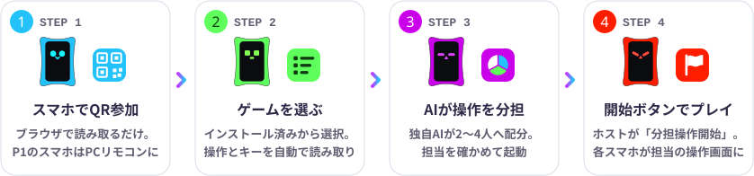
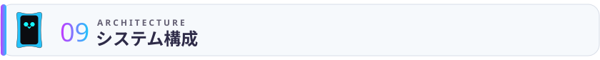
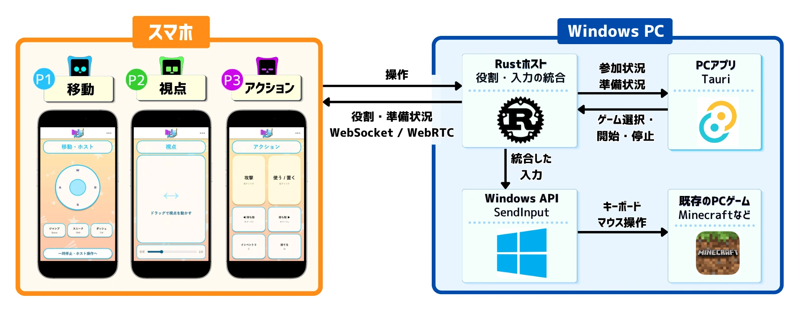
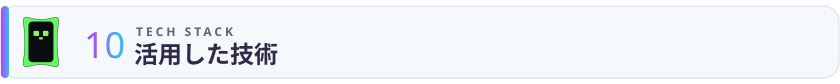
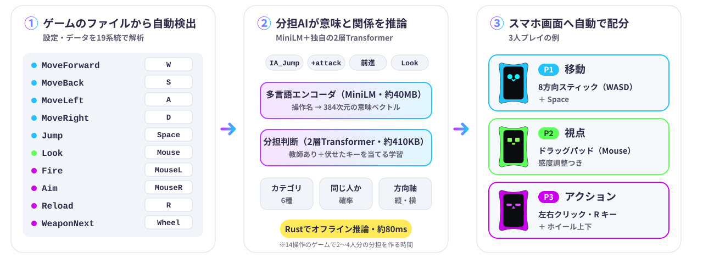
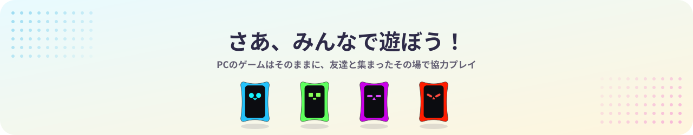

<h1>Re:Cooplay（リコープレイ）-ゲームはそのまま。1キャラを、みんなで操作。-</h1>

  <a href="#製品概要"><b>製品概要</b></a>&nbsp;·&nbsp;
  <a href="#製品説明具体的な製品の説明"><b>遊び方</b></a>&nbsp;·&nbsp;
  <a href="#特長"><b>特長</b></a>&nbsp;·&nbsp;
  <a href="#試遊での反応"><b>試遊での反応</b></a>&nbsp;·&nbsp;
  <a href="#開発技術"><b>開発技術</b></a>&nbsp;·&nbsp;
  <a href="#独自技術"><b>独自技術</b></a>&nbsp;·&nbsp;
  <a href="#技術仕様書"><b>技術仕様書</b></a>

▶ 画像をクリックすると、YouTubeでプロダクト紹介動画を再生します。

 

  
  

  
  

  ## 🎉 JPHACKS 2026 受賞結果 🎉
  ### **🏆 Hack Day (金沢会場)**
  **🥇 Hack Day Audience Award**  
  **🎯 Award Day Finalist**

  ---
  ### **🏆 Award Day**
  **🏅 審査委員特別賞**    **💡 Innovator認定** 
  **🎁 企業賞受賞**  
  合同会社DMM.com賞

 

Re:Cooplayは、**既存のPCゲームに協力プレイを後付けするシステム**です。

1台のPC画面を友達と囲み、普段は1人で操作するキャラクターを2〜4人で分担して動かします。コントローラーは各自のスマートフォンのブラウザなので、専用の機器もアプリも要りません。ゲームの操作名とキー割り当てを自動で読み取り、独自AIが参加人数に合わせて分担とスマホの操作画面を作ります。

<picture>
  <source media="(max-width: 700px)" srcset="assets/readme/scenes/scene-01-daruma-narrow.svg">
  
</picture>

## 製品概要

### <picture><source media="(max-width: 700px) and (prefers-color-scheme: dark)" srcset="assets/readme/heads/head-01-narrow-dark.svg"><source media="(max-width: 700px)" srcset="assets/readme/heads/head-01-narrow-light.svg"><source media="(prefers-color-scheme: dark)" srcset="assets/readme/heads/head-01-dark.svg"></picture>

クリアした、遊び尽くした、なんとなく飽きた。そうして遊ばなくなったゲームが、PCの中に眠っていませんか？

眠っているゲーム、遊び慣れたゲーム、1人では手を出しにくく遊べずにいたゲーム。そうした既存のゲームに新しい価値を後付けすることで、思わず遊びたくなるゲームに変えられないか。私たちはそう考えました。

たどり着いたのが、**1人分の操作をみんなで分け合う**という遊び方です。移動する人と視点を動かす人が違うと、思った方向へ進むだけでも声を掛け合う必要があります。息が合わずに起こるハプニングも、連携が決まったときの達成感も、全員で分かち合う体験です。ゲームの中身はそのままで、**全く新しい協力プレイの体験を後付け**できます。

> [!TIP]
> **操作を分担する不自由さが、そのまま新しい面白さになる。**
> ゲーム自体は変えずに、操作する人と協力の仕方を変える。手元のゲームを、友達と集まったその場で新しい協力ゲームにします。

<picture>
  <source media="(max-width: 700px)" srcset="assets/readme/scenes/scene-02-chase-narrow.svg">
  
</picture>

### <picture><source media="(max-width: 700px) and (prefers-color-scheme: dark)" srcset="assets/readme/heads/head-02-narrow-dark.svg"><source media="(max-width: 700px)" srcset="assets/readme/heads/head-02-narrow-light.svg"><source media="(prefers-color-scheme: dark)" srcset="assets/readme/heads/head-02-dark.svg"></picture>

> **既存ゲーム × Tech：1つのキャラクターを、みんなで動かす**

1. **スマホで参加：** PCアプリのQRコードをスマホのブラウザで読み取ります。最初の参加者（P1・ホスト）のスマホはタッチパッド付きのリモコンになり、手元からPC画面やランチャーを操作できます。
2. **ゲームを選択：** PCにインストール済みのゲームを一覧から選びます。選んだゲームの操作名とキー設定を自動で読み取ります。
3. **操作を分担：** ゲームの操作と参加人数（2〜4人）に合わせて、独自AIが分担を作ります。担当を確かめて、そのままゲームを起動します。
4. **開始ボタンでプレイ：** ホストが「分担操作開始」を押すとゲームが前面に切り替わり、各スマホが自分の担当操作だけを並べたコントローラーになります。

3人で『Minecraft』を遊ぶ場合の分担例です。

| プレイヤー | 担当する操作 | スマホに表示されるUI |
|---|---|---|
| **P1**（ホスト） | 移動・ジャンプ・スニーク・ダッシュ | 8方向スティック＋アクションボタン |
| **P2** | 視点・カメラ操作 | 感度調整つきドラッグパッド |
| **P3** | 攻撃・ブロック設置・持ち物切替・インベントリ | 左右クリック・ホイール・キーボタン |

実際の画面遷移は[PC・スマホの画面一覧](docs/screenshots.md)で確認できます。

 

<picture>
  <source media="(max-width: 700px) and (prefers-color-scheme: dark)" srcset="assets/readme/flow-narrow-dark.svg">
  <source media="(max-width: 700px)" srcset="assets/readme/flow-narrow-light.svg">
  <source media="(prefers-color-scheme: dark)" srcset="assets/readme/flow-dark.svg">
  
</picture>

  
  

<picture>
  <source media="(max-width: 700px)" srcset="assets/readme/scenes/scene-03-train-narrow.svg">
  
</picture>

### <picture><source media="(max-width: 700px) and (prefers-color-scheme: dark)" srcset="assets/readme/heads/head-03-narrow-dark.svg"><source media="(max-width: 700px)" srcset="assets/readme/heads/head-03-narrow-light.svg"><source media="(prefers-color-scheme: dark)" srcset="assets/readme/heads/head-03-dark.svg"></picture>

#### 1. 1つのキャラクターを2〜4人で分担する

移動・視点・アクションなどを分け合い、各スマホには自分の担当操作だけが並びます。ボタンの位置や大きさは持ち方に合わせて変えられ、60秒ごとに担当が入れ替わる交代ルールも選べます。

#### 2. 選んだゲームがそのまま協力ゲームになる

PCに入っているゲームを選ぶだけで、その操作に合った分担とコントローラーをその場で用意します。特定のタイトルに限らず、手元のPCゲームで共同操作を楽しめます。

#### 3. 専用の機器もアプリも要らない

Android・iPhoneの標準ブラウザでQRコードを読み取れば参加できます。ホストのスマホがリモコンになるので、PCのキーボードとマウスに触らずに、ゲーム選びから開始まで進められます。

<picture>
  <source media="(max-width: 700px)" srcset="assets/readme/scenes/scene-04-rope-narrow.svg">
  
</picture>

### <picture><source media="(max-width: 700px) and (prefers-color-scheme: dark)" srcset="assets/readme/heads/head-04-narrow-dark.svg"><source media="(max-width: 700px)" srcset="assets/readme/heads/head-04-narrow-light.svg"><source media="(prefers-color-scheme: dark)" srcset="assets/readme/heads/head-04-dark.svg"></picture>

Re:Cooplayは、手元のPCゲームに、全く新しい協力プレイの体験を後付けします。眠っていたゲームも、遊び慣れたゲームも、1人では手を出しにくかったゲームも、操作を分け合うだけで新しい協力ゲームとして遊べます。試遊では、そのゲームを遊んだことのある21名のうち20名（95.2%）が「1人で遊んだときと違うプレイ体験だった」と答えました。

#### ジャンルごとに違う協力体験が生まれる

| ジャンルと分担の例 | 生まれる体験 |
|---|---|
| **3D空間を動くゲーム** 『Minecraft』など 分担：移動・ジャンプ／視点・カメラ／攻撃・アイテム使用 | 狙った場所へ進むだけでも声掛けが要り、見慣れたワールドでの冒険や建築が共同作業になる |
| **ホラー・サバイバルホラー** 『Outlast（アウトラスト）』『バイオハザード』など 分担：移動／視点・照準／ライト・攻撃 | 1人では足がすくむ場面も、声を掛け合いながら進める。驚いた瞬間の悲鳴や笑いも全員で共有できる |
| **パズル・落ち物** 『テトリス』など 分担：左右移動／回転／落下 | 「右！」「今、回して！」と息を合わせる、テンポの速いパーティーゲームになる |
| **レース・ドライブ** 分担：ハンドル／アクセル・ブレーキ／視点・ライト・ギア | まっすぐ走るだけでも、互いの呼吸を合わせる必要がある |

アクションRPG、2Dアクション、シミュレーションなど、ほかのジャンルでも、1人分の操作を分け合うことで1人プレイとはまったく違う面白さが生まれます。

#### その場の全員が、1つの役割からプレイヤーになれる

友達と集まったら、1人用のゲームも全員で一緒に遊べます。ゲームが苦手な人も、すべての操作を1人でこなす必要はありません。「移動だけ」「ジャンプと攻撃だけ」のように一部の操作に集中でき、ほかの操作は友達が受け持ってくれるので、気軽に遊べます。PCゲームに慣れた人と初めての人が、同じキャラクターを動かしてクリアする喜びを対等に分かち合えます。

<picture>
  <source media="(max-width: 700px)" srcset="assets/readme/scenes/scene-08-seesaw-narrow.svg">
  
</picture>

### <picture><source media="(max-width: 700px) and (prefers-color-scheme: dark)" srcset="assets/readme/heads/head-05-narrow-dark.svg"><source media="(max-width: 700px)" srcset="assets/readme/heads/head-05-narrow-light.svg"><source media="(prefers-color-scheme: dark)" srcset="assets/readme/heads/head-05-dark.svg"></picture>

<b>実プレイ映像</b>

 

移動・視点・攻撃を3人で分担し、1つのキャラクターを共同操作したHack Day中の実プレイです。

https://github.com/user-attachments/assets/60d577f4-e287-45bc-bc6a-09455dd017c3

実プレイ映像：[『Outlast』を2人で分担して遊ぶ様子（約3分18秒）](https://drive.google.com/file/d/1ZdPi9M9zD87YS8cdn4fIGKjNNi-r7Ewt/view) ／ [驚いた場面の切り抜き（約11秒）](https://drive.google.com/file/d/1HzBcDEd4Hm6iXMjvd6CHqWi29Rwi6NfX/view)。紹介動画では『Terraria』での共同操作も実演しています。

試遊アンケート（回答者26名）の結果です。

| 質問 | 結果 |
|---|---|
| 楽しかった・またこの遊び方をしてみたい | **100%**（26名全員） |
| 1人で遊んだときと違うプレイ体験だった | **95.2%**（そのゲームの経験者21名中20名） |
| 自分の担当操作を思い通りに動かせた | **84.6%**（22名） |

各自の操作は思い通りに動かせる一方で、複数人で息を合わせる連携そのものが新しいゲーム体験を生むことが実証されました。

**試遊者の声**（自由記述から抜粋）

> 「一人で遊ぶ時は最初流れ作業になってしまうが、役割分担することで最初から楽しむことができた。ゲーム内容は同じだけど、操作性が大きく変わることで、新たな楽しみ方を実際に行うことができた」 
> Minecraft・4人プレイ
>
> 「普段はなんてことない作業でも一つのイベントのように苦戦し、いつも以上に印象に残りました」 
> Minecraft・4人プレイ
>
> 「1人プレイでも他の人と一緒にプレイしてる感覚になった」「1人で完結できないため仲良くなるには適していた」 
> Minecraft・3人プレイ
>
> 「FPSゲーム（Outlast）を複数人で遊ぶのが非常に面白かった」 
> Outlast・2人プレイ・初プレイ

<picture>
  <source media="(max-width: 700px)" srcset="assets/readme/scenes/scene-09-tug-narrow.svg">
  
</picture>

### <picture><source media="(max-width: 700px) and (prefers-color-scheme: dark)" srcset="assets/readme/heads/head-06-narrow-dark.svg"><source media="(max-width: 700px)" srcset="assets/readme/heads/head-06-narrow-light.svg"><source media="(prefers-color-scheme: dark)" srcset="assets/readme/heads/head-06-dark.svg"></picture>

| 段階 | 目指すこと |
|---|---|
| **まず** | 初めての人でも迷わず導入・参加できるように仕上げ、**誰もが手元のPCで遊べるサービスとして公開する** |
| **その先** | 対応するゲームと設定形式を増やし、PCゲーム以外のプラットフォームや、離れた場所の友達と同じキャラクターを操作するオンライン対応へ広げる |

<picture>
  <source media="(max-width: 700px)" srcset="assets/readme/scenes/scene-06-hide-narrow.svg">
  
</picture>

### <picture><source media="(max-width: 700px) and (prefers-color-scheme: dark)" srcset="assets/readme/heads/head-07-narrow-dark.svg"><source media="(max-width: 700px)" srcset="assets/readme/heads/head-07-narrow-light.svg"><source media="(prefers-color-scheme: dark)" srcset="assets/readme/heads/head-07-dark.svg"></picture>

「友達と集まったその場で、いつものPCゲームをすぐにみんなで遊べること」を目指し、3つの点に注力しました。

1. **準備から開始まで、スマホだけで進む導線**  
   P1のスマホをタッチパッド付きのリモコンにして、ゲームの選択・ランチャーの操作・起動・開始まで手元で進められるようにしました。試遊での意見を受けて、参加者のワンタップ退出と、全員リセット時の一時Wi-Fiへの自動切り替えも加えました。
2. **意味のまとまりで分ける分担と、持ち方に合わせるUI編集**  
   キーを等分するのではなく、「移動」「視点」「照準と攻撃」のように、意味のつながりと負担の釣り合いを見て独自AIが配分します。「持ち方に合わせてボタンの配置を変えたい」という試遊者の声から、スマホ上でボタンの位置と縦横のサイズを変えられるようにしました。
3. **違和感のない低遅延**  
   PCのWindowsモバイルホットスポットでスマホと直接つなぎ、WebSocketとWebRTC DataChannelの2経路で送ります。実機の測定では、Wi-Fiの往復遅延が中央値9.0ms、スマホの操作からPCで入力するまでの推定遅延が中央値26.0msでした。電波が混み合う展示会場でも「ラグなく動かせる」「感度が変えられて快適」と評価されました。

<picture>
  <source media="(max-width: 700px)" srcset="assets/readme/scenes/scene-07-volley-narrow.svg">
  
</picture>

## <picture><source media="(max-width: 700px) and (prefers-color-scheme: dark)" srcset="assets/readme/heads/head-08-narrow-dark.svg"><source media="(max-width: 700px)" srcset="assets/readme/heads/head-08-narrow-light.svg"><source media="(prefers-color-scheme: dark)" srcset="assets/readme/heads/head-08-dark.svg"></picture>

| 資料 | 内容 |
|---|---|
| [総合仕様書](docs/README.md) | システム構成・動作環境と詳細仕様への入口 |
| [技術選定の理由](docs/technology-selection.md) | 低遅延・操作の確実性を重視した採用理由と代替案の比較 |
| [ゲーム操作定義仕様書](docs/game-profile-specification.md) | ゲーム別の操作自動検出・キー設定読取り・人数別分担 |
| [分担AI仕様書](docs/preset-model-specification.md) | 独自AIによる分担の構成・学習・推論と評価 |
| [Re:Cooplay Preset Model v2](https://huggingface.co/YOSHI0209/recooplay-preset-model-v2#recooplay-preset-model-v2) | 操作の意味と関係から分担を生成する独自モデル（Hugging Face） |
| [画面一覧](docs/screenshots.md) | PC・スマホの画面と使用の流れ |

詳細：[フロントエンド](docs/frontend-specification.md) ／ [ホスト](docs/host-specification.md) ／ [通信](docs/protocol-specification.md) ／ [動作確認の範囲](docs/verification.md)

<picture>
  <source media="(max-width: 700px)" srcset="assets/readme/scenes/scene-05-domino-narrow.svg">
  
</picture>

## 開発技術

### <picture><source media="(max-width: 700px) and (prefers-color-scheme: dark)" srcset="assets/readme/heads/head-09-narrow-dark.svg"><source media="(max-width: 700px)" srcset="assets/readme/heads/head-09-narrow-light.svg"><source media="(prefers-color-scheme: dark)" srcset="assets/readme/heads/head-09-dark.svg"></picture>

各スマートフォンのブラウザで行った操作を、ローカルWi-Fi経由でPC上のRustホストが受け取ります。ホストは参加者ごとの担当・入力の順序・入力先のウィンドウを確かめて1つの入力にまとめ、Windows標準の`SendInput` APIでPCゲームへ送ります。

  <a href="assets/images/recooplay-system-architecture.webp"></a>

### <picture><source media="(max-width: 700px) and (prefers-color-scheme: dark)" srcset="assets/readme/heads/head-10-narrow-dark.svg"><source media="(max-width: 700px)" srcset="assets/readme/heads/head-10-narrow-light.svg"><source media="(prefers-color-scheme: dark)" srcset="assets/readme/heads/head-10-dark.svg"></picture>

#### API・データ

- Windows API（`SendInput`・ウィンドウ前面制御・モバイルホットスポット制御）
- WebSocket、WebRTC DataChannel
- JSONによるゲーム操作定義、各ゲームエンジンの設定・パッケージデータ解析

#### フレームワーク・ライブラリ・モジュール

- **PCホスト・デスクトップアプリ：** Rust（Tokio・axum・`windows`・`datachannel`・`tokenizers`）、Tauri 2／WebView2
- **フロントエンド・UI：** React・TypeScript strict（Vite）、Pointer Events API
- **独自AI（操作分担）：** [Re:Cooplay Preset Model v2](https://huggingface.co/YOSHI0209/recooplay-preset-model-v2#recooplay-preset-model-v2)（事前学習済み多言語エンコーダ＋分担判断用の2層Transformerエンコーダ、Rustで推論）
- **検証・シミュレーション：** Node.js（通信境界・画面・入力プローブの自動検証）

#### デバイス

- Windows 11 PC（ホスト・ゲーム実行）
- Android／iPhone（標準ブラウザから参加）
- 通信はローカルWi-Fi（PCのモバイルホットスポットを含む）だけで完結するので、インターネットにつながらない場所でも2〜4人で共同操作できます。

  
  
  
  
  
  
  
  
  
  

### <picture><source media="(max-width: 700px) and (prefers-color-scheme: dark)" srcset="assets/readme/heads/head-11-narrow-dark.svg"><source media="(max-width: 700px)" srcset="assets/readme/heads/head-11-narrow-light.svg"><source media="(prefers-color-scheme: dark)" srcset="assets/readme/heads/head-11-dark.svg"></picture>

#### ハッカソンで開発した独自機能・技術

ゲームのファイルから操作を読み取り、独自AIが分担を決め、各スマホの操作画面と入力の統合までを一貫して開発しました。

<picture>
  <source media="(max-width: 700px) and (prefers-color-scheme: dark)" srcset="assets/readme/pipeline-narrow-dark.svg">
  <source media="(max-width: 700px)" srcset="assets/readme/pipeline-narrow-light.svg">
  <source media="(prefers-color-scheme: dark)" srcset="assets/readme/pipeline-dark.svg">
  
</picture>

#### ① 操作名とキー割り当ての自動検出（19系統）

- Steam・Epic Games・GOG・Xboxなど7系統のランチャーから、インストール済みのゲームを検出します。
- Unity（Input System／旧Input Manager）、Unreal Engine 4・5、Godot 3・4、RPGツクール2000〜MZ、WOLF RPGエディター、Source 1・2など、計19系統のゲームファイルとユーザー設定を直接読み取ります。ユーザーが変えたキー設定も含めて、操作の定義を取り出します。

#### ② 操作分担AI（Re:Cooplay Preset Model v2）

事前学習済みのBERT系モデルと、独自に学習させたTransformerを組み合わせています。

- **操作名の読み取り（約40MB）：** 多言語モデル `paraphrase-multilingual-MiniLM-L12-v2` の語彙を43,691語に絞り、行ごとに8ビット量子化しました。日本語の操作名と、ゲーム内の英語の識別子（`IA_Jump`・`+attack`・`MoveForward` など）の両方を、384次元の意味ベクトルに変換します。
- **分担の判断（約410KB、104,136パラメータ）：** 教師あり学習と、伏せたキーを当てる自己教師あり学習で育てた2層Transformerエンコーダです。①操作のカテゴリ（6種）、②同じ人が持つべきかの確率、③同じまとまりの中の方向軸（縦・横）を同時に推定します。
- **オフラインで速く推論：** Rustホストが直接推論し、14操作のゲームなら約80ミリ秒で2〜4人の分担を作って保存します。

| 評価に使ったゲーム（学習に未使用、ゲームごとの平均） | カテゴリの正解率 | 同じ人の判定 | 同じまとまりの再現率 | 同じ軸の判定 |
|:--|--:|--:|--:|--:|
| GitHub の Unity・Godot の操作定義 57本（生の名前、4組に分けた評価） | **88.1%** | **94.5%** | **91.8%** | **94.6%** |
| ゲームのファイルから読んだ操作 6本（生の名前、1本ずつ外した評価） | 76.0% | 89.3% | 75.9% | 91.5% |

※人が正解を確かめた30本（246操作）でのカテゴリの正解率は87.4%です。

#### ③ 2経路の通信と、安全な入力の統合

- **2経路の使い分けと視点の補間：** 確実に届けたい状態の共有はWebSocket、視点の移動や連打のように速さが要る入力はWebRTC DataChannel（最新の入力を優先するUDPの高速通信）で送ります。Rustホストは1本のhubスレッドで重複を除き、4ms周期で視点の動きを滑らかに補ってから、Win32 `SendInput` で入力します。
- **何重もの安全設計：** 対象のゲームが前面にあるときだけ入力を送ります。一時停止・切断・緊急停止（`Ctrl+Alt+F12`）・終了のときは、押している全キーとマウスボタンをすぐに離して止めます。

#### ④ 担当と持ち方に合わせるスマホUIとPCリモコン

- **描画と入力処理の分離：** React＋TypeScript strictの画面描画から、Pointer Eventsの入力と通信の処理を切り離し、スマホのブラウザでも操作への反応を速く保ちます。
- **個人のレイアウト編集とリモコン：** 各スマホでボタンの移動・サイズ変更・複製・横持ちへの変換ができます。ロビーでは、P1のスマホがPC画面とOSのカーソルを操作するリモコンになります。

#### 力を入れた部分のコードと資料

| 独自技術 | コード・資料 |
|---|---|
| ① 操作名とキー割り当ての自動検出（19系統） | [読み取りの対応表](docs/game-profile-specification.md#定義のないゲームのファイルからの読み取り) [操作抽出の入口](apps/host-rs/src/game_actions.rs) [エンジン別パーサー群](apps/host-rs/src/engines/) [キー設定の取得](apps/host-rs/src/keybinds.rs) |
| ② 操作分担AI（Re:Cooplay Preset Model v2） | [分担AI仕様書](docs/preset-model-specification.md) [Hugging Faceモデルカード](https://huggingface.co/YOSHI0209/recooplay-preset-model-v2#recooplay-preset-model-v2) [推論・クラスタリング](apps/host-rs/src/preset_model.rs) [MiniLMトークナイザー・埋め込み](apps/host-rs/src/text_encoder.rs) |
| ③ 2経路の通信と、安全な入力の統合 | [通信処理](apps/host-rs/src/rtc.rs) [入力統合・順序制御](apps/host-rs/src/hub.rs) [入力先の制御](apps/host-rs/src/focus.rs) [Windows入力](apps/host-rs/src/input.rs) |
| ④ 担当と持ち方に合わせるスマホUIとPCリモコン | [コントローラー生成](apps/web/src/shared/controller-layout.ts) [個人レイアウト設計](apps/web/src/shared/model/layout.ts) [コントローラー編集UI](apps/web/src/phone/LayoutController.tsx) [動作確認の範囲](docs/verification.md) |

<picture>
  <source media="(max-width: 700px)" srcset="assets/readme/scenes/scene-10-nap-narrow.svg">
  
</picture>

<picture>
  <source media="(max-width: 700px) and (prefers-color-scheme: dark)" srcset="assets/readme/footer-narrow-dark.svg">
  <source media="(max-width: 700px)" srcset="assets/readme/footer-narrow-light.svg">
  <source media="(prefers-color-scheme: dark)" srcset="assets/readme/footer-dark.svg">
  
</picture>

Re:Cooplayは独立した非公式システムであり、Minecraftのゲーム本体・素材を同梱していません。Minecraftの公式製品ではなく、Mojang Studios・Microsoftの承認・提携を受けていません。NOT AN OFFICIAL MINECRAFT PRODUCT. NOT APPROVED BY OR ASSOCIATED WITH MOJANG OR MICROSOFT. [Minecraftの利用条件に関する確認記録](docs/develop/decisions/2026-10-25-minecraft-usage-terms.md)
